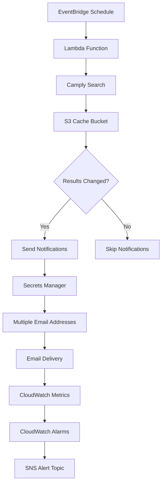

# Design Document

## Overview

This design enhances the existing camply checker system with two key improvements:

1. **Reliable Offline Search**: Implement proper result comparison using S3 storage to prevent duplicate notifications
2. **Multi-Email Notifications with Monitoring**: Support multiple email recipients stored in AWS Secrets Manager with CloudWatch alarms for delivery failures

The solution builds upon the existing AWS CDK infrastructure, leveraging the current S3 cache bucket and adding new CloudWatch metrics and alarms for email delivery monitoring.

## Architecture

### Current Architecture

- Lambda function triggered by EventBridge on a schedule
- S3 bucket for caching (currently underutilized)
- SNS topic for system alerts
- Secrets Manager for alert email configuration

### Enhanced Architecture

- **S3-based Result Storage**: Store search results as JSON files in the cache bucket with campground-specific keys
- **Result Comparison Logic**: Compare current search results with previous results before sending notifications
- **Multi-Email Support**: Extend Secrets Manager secret to support multiple email addresses
- **Email Delivery Monitoring**: Add CloudWatch metrics and alarms for email delivery success/failure tracking



## Components and Interfaces

### 1. Enhanced Lambda Function (Python)

**New Components:**

- `ResultComparator`: Class to handle result comparison logic
- `S3ResultStore`: Class to manage storing/retrieving results from S3
- `MultiEmailNotifier`: Class to handle multiple email notifications
- `MetricsPublisher`: Class to publish CloudWatch metrics

**Key Methods:**

```python
class ResultComparator:
    def compare_results(self, current: dict, previous: dict) -> bool
    def normalize_results(self, results: dict) -> dict

class S3ResultStore:
    def store_results(self, campground_id: str, results: dict) -> None
    def retrieve_results(self, campground_id: str) -> dict | None
    def generate_key(self, campground_id: str) -> str

class MultiEmailNotifier:
    def get_email_addresses(self) -> list[str]
    def send_notifications(self, addresses: list[str], subject: str, body: str) -> dict
    def publish_metrics(self, success_count: int, failure_count: int) -> None
```

### 2. Enhanced CDK Infrastructure

**Modified Components:**

- `AlertEmailSecret`: Update to support multiple email addresses in JSON format
- `CamplyLambda`: Add IAM permissions for CloudWatch metrics and enhanced S3 access
- Add new CloudWatch alarms for email delivery monitoring

**New Environment Variables:**

- `NOTIFICATION_EMAIL_SECRET_NAME`: Name of the secret containing notification email addresses

### 3. Secrets Manager Schema

**Current Schema:**

```json
{
  "email": "single@email.com"
}
```

**Enhanced Schema:**

```json
{
  "emails": ["first@email.com", "second@email.com", "third@email.com"]
}
```

## Data Models

### Search Result Storage Format

```json
{
  "campground_id": "766",
  "campground_name": "Steep Ravine",
  "timestamp": "2025-01-08T10:30:00Z",
  "search_parameters": {
    "start_date": "2025-01-08",
    "end_date": "2025-02-07",
    "provider": "ReserveCalifornia"
  },
  "results": {
    "available_sites": [
      {
        "site_id": "123",
        "site_name": "Site A",
        "dates": ["2025-01-15", "2025-01-16"]
      }
    ],
    "total_available_nights": 2
  },
  "result_hash": "sha256_hash_of_normalized_results"
}
```

### CloudWatch Metrics Schema

```json
{
  "MetricName": "EmailDeliverySuccess",
  "Namespace": "CamplySiteCheck/Notifications",
  "Dimensions": [
    { "Name": "CampgroundId", "Value": "766" },
    { "Name": "EmailAddress", "Value": "masked_email" }
  ],
  "Value": 1,
  "Unit": "Count"
}
```

## Error Handling

### S3 Operations

- **Connection Failures**: Log error, continue with notification sending (treat as no previous results)
- **Permission Errors**: Log error, trigger CloudWatch alarm, continue processing
- **Malformed Data**: Log warning, treat as no previous results, overwrite with current results

### Email Delivery

- **Secret Retrieval Failure**: Log error, trigger CloudWatch alarm, skip notifications
- **SMTP Failures**: Log individual failures, continue with remaining recipients, publish failure metrics
- **Configuration Errors**: Log error, trigger CloudWatch alarm, continue processing

### Result Comparison

- **Comparison Errors**: Log warning, default to sending notifications (fail-safe approach)
- **Hash Generation Errors**: Log warning, fall back to full result comparison

## Testing Strategy

### Unit Tests

- `ResultComparator` logic with various result formats
- `S3ResultStore` operations with mocked S3 client
- `MultiEmailNotifier` with mocked SMTP and Secrets Manager
- Error handling scenarios for all components

### Integration Tests

- End-to-end Lambda execution with real S3 bucket
- Secrets Manager integration with multiple email formats
- CloudWatch metrics publishing verification
- Email delivery testing with test SMTP server

### Load Tests

- Multiple campground searches with result storage
- Concurrent Lambda executions with S3 access
- Email delivery performance with multiple recipients

### Monitoring Tests

- CloudWatch alarm triggering scenarios
- Metric accuracy verification
- Alert delivery confirmation
